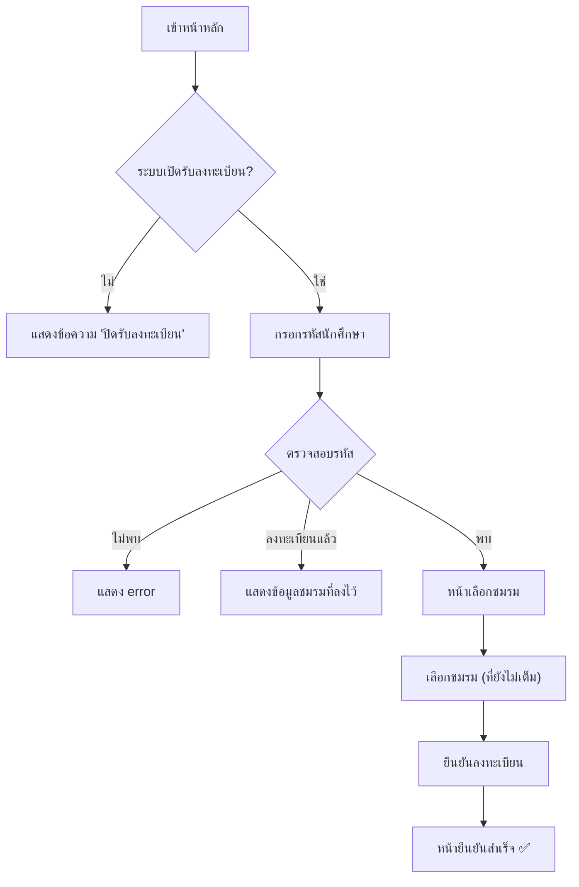
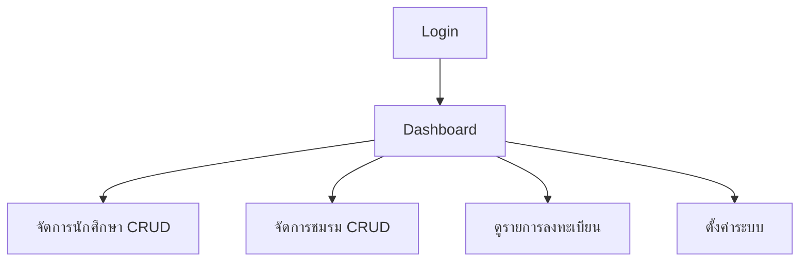
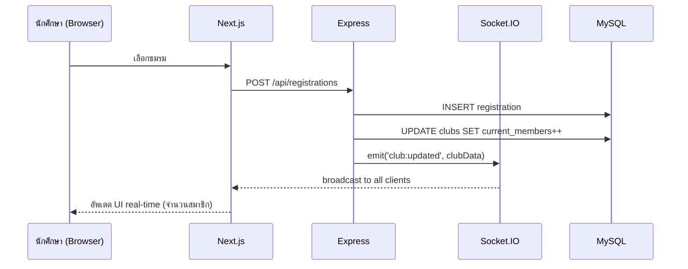

# ระบบลงทะเบียนชมรมนักเรียน/นักศึกษา — แผนกเทคโนโลยีสารสนเทศ วิทยาลัยเทคนิค

ระบบลงทะเบียนเลือกชมรมสำหรับนักเรียน/นักศึกษา พร้อมแดชบอร์ดแอดมิน รองรับ real-time ด้วย Socket.IO ธีมสีแดง-ขาว ฟอนต์ Prompt

---

## Tech Stack

| Layer     | Technology                          |
| --------- | ----------------------------------- |
| Frontend  | Next.js 16 + Tailwind CSS v4        |
| Backend   | Express 5 + Socket.IO               |
| Database  | MySQL 8                             |
| DB Admin  | phpMyAdmin                          |
| Real-time | Socket.IO (WebSocket)               |
| Container | Docker Compose                      |
| Font      | Prompt (Google Fonts)               |
| Theme     | 🔴 แดง `#DC2626` / ⚪ ขาว `#FFFFFF` |

---

## Database Schema

```sql
-- ตาราง admins
CREATE TABLE admins (
  id INT AUTO_INCREMENT PRIMARY KEY,
  username VARCHAR(50) UNIQUE NOT NULL,
  password VARCHAR(255) NOT NULL,     -- bcrypt hashed
  created_at TIMESTAMP DEFAULT CURRENT_TIMESTAMP
);

-- ตาราง students (นักเรียน/นักศึกษา)
CREATE TABLE students (
  id INT AUTO_INCREMENT PRIMARY KEY,
  student_id VARCHAR(20) UNIQUE NOT NULL,  -- รหัสนักศึกษา
  prefix VARCHAR(20) NOT NULL,             -- คำนำหน้า
  first_name VARCHAR(100) NOT NULL,
  last_name VARCHAR(100) NOT NULL,
  level VARCHAR(50) NOT NULL,              -- ระดับชั้น เช่น ปวช.1, ปวส.2
  created_at TIMESTAMP DEFAULT CURRENT_TIMESTAMP
);

-- ตาราง clubs (ชมรม)
CREATE TABLE clubs (
  id INT AUTO_INCREMENT PRIMARY KEY,
  name VARCHAR(200) NOT NULL,
  description TEXT,
  max_members INT NOT NULL DEFAULT 30,
  current_members INT NOT NULL DEFAULT 0,
  image_url VARCHAR(500),
  is_active BOOLEAN DEFAULT TRUE,
  created_at TIMESTAMP DEFAULT CURRENT_TIMESTAMP
);

-- ตาราง registrations (การลงทะเบียน)
CREATE TABLE registrations (
  id INT AUTO_INCREMENT PRIMARY KEY,
  student_id INT NOT NULL,
  club_id INT NOT NULL,
  registered_at TIMESTAMP DEFAULT CURRENT_TIMESTAMP,
  FOREIGN KEY (student_id) REFERENCES students(id) ON DELETE CASCADE,
  FOREIGN KEY (club_id) REFERENCES clubs(id) ON DELETE CASCADE,
  UNIQUE KEY unique_student_club (student_id)  -- นักศึกษา 1 คนลงได้ 1 ชมรม
);

-- ตาราง settings (ตั้งค่าระบบ)
CREATE TABLE settings (
  id INT AUTO_INCREMENT PRIMARY KEY,
  setting_key VARCHAR(100) UNIQUE NOT NULL,
  setting_value TEXT NOT NULL
);
-- setting_key: 'registration_deadline' -> datetime string
-- setting_key: 'registration_open' -> 'true'/'false'
```

---

## Proposed Changes

### Docker Infrastructure

#### [MODIFY] [docker-compose.yml](file:///d:/attendance/docker-compose.yml)

Development docker-compose ประกอบด้วย 4 services:

1. **mysql** — MySQL 8 container, port 13307 on host, volume persist data, init schema via `init.sql`
2. **phpmyadmin** — phpMyAdmin, port 18081, เชื่อมต่อ MySQL
3. **backend** — Bun runtime Express app, port 14001, hot-reload with Bun watch, mount volume
4. **frontend** — Bun runtime Next.js dev server, port 13001, mount volume

#### [MODIFY] [docker-compose.prod.yml](file:///d:/attendance/docker-compose.prod.yml)

Production compose — ใช้ Dockerfile build, ไม่มี hot-reload

---

### Backend (Express + Socket.IO)

#### [NEW] [init.sql](file:///d:/attendance/backend/init.sql)

- SQL schema ตาม Database Schema ด้านบน
- Seed admin user เริ่มต้น (admin / admin123)
- Seed ชมรมตัวอย่าง 5-6 ชมรม

#### [NEW] [Dockerfile](file:///d:/attendance/backend/Dockerfile)

- Bun base image
- Copy, install deps with Bun, expose 4000

#### [MODIFY] [package.json](file:///d:/attendance/backend/package.json)

- เพิ่ม dependencies: `mysql2`, `socket.io`, `cors`, `bcryptjs`, `jsonwebtoken`, `dotenv`
- เพิ่ม scripts: `dev`, `start` สำหรับ Bun

#### [NEW] [server.js](file:///d:/attendance/backend/server.js)

- Express app + HTTP server + Socket.IO
- CORS config สำหรับ frontend
- Mount routers

#### [NEW] [db.js](file:///d:/attendance/backend/db.js)

- MySQL connection pool (mysql2/promise)

#### [NEW] [middleware/auth.js](file:///d:/attendance/backend/middleware/auth.js)

- JWT verification middleware สำหรับ admin routes

#### [NEW] [routes/auth.js](file:///d:/attendance/backend/routes/auth.js)

- `POST /api/auth/login` — Admin login, return JWT
- `GET /api/auth/me` — Verify current admin

#### [NEW] [routes/students.js](file:///d:/attendance/backend/routes/students.js)

- `GET /api/students` — List all students (admin)
- `POST /api/students` — Create student (admin)
- `PUT /api/students/:id` — Update student (admin)
- `DELETE /api/students/:id` — Delete student (admin)
- `POST /api/students/verify` — ตรวจสอบรหัสนักศึกษาเพื่อลงทะเบียน (public)

#### [NEW] [routes/clubs.js](file:///d:/attendance/backend/routes/clubs.js)

- `GET /api/clubs` — List all clubs + จำนวนสมาชิก (public, real-time data)
- `POST /api/clubs` — Create club (admin)
- `PUT /api/clubs/:id` — Update club (admin)
- `DELETE /api/clubs/:id` — Delete club (admin)

#### [NEW] [routes/registrations.js](file:///d:/attendance/backend/routes/registrations.js)

- `POST /api/registrations` — ลงทะเบียนชมรม (student) → emit Socket.IO event
- `GET /api/registrations` — List all registrations (admin)
- `DELETE /api/registrations/:id` — ยกเลิกลงทะเบียน (admin) → emit Socket.IO event

#### [NEW] [routes/settings.js](file:///d:/attendance/backend/routes/settings.js)

- `GET /api/settings` — Get registration settings (public)
- `PUT /api/settings` — Update settings (admin)

#### [NEW] [socket.js](file:///d:/attendance/backend/socket.js)

- Socket.IO event handlers
- Events: `club:updated`, `registration:new`, `registration:removed`, `settings:changed`
- Broadcast จำนวนสมาชิกชมรมแบบ real-time

---

### Frontend (Next.js)

#### [NEW] [Dockerfile](file:///d:/attendance/frontend/Dockerfile)

- Node 20 Alpine, multi-stage build

#### [MODIFY] [package.json](file:///d:/attendance/frontend/package.json)

- เพิ่ม dependencies: `socket.io-client`, `axios`, `react-hot-toast`, `lucide-react`, `framer-motion`

#### [MODIFY] [globals.css](file:///d:/attendance/frontend/src/app/globals.css)

- ธีมสีแดง-ขาว
- Custom CSS variables สำหรับ red/white palette
- กำหนด font Prompt เป็นค่า default

#### [MODIFY] [layout.js](file:///d:/attendance/frontend/src/app/layout.js)

- ใช้ฟอนต์ Prompt จาก `next/font/google`
- Metadata ภาษาไทย
- `lang="th"`

#### [MODIFY] [page.js](file:///d:/attendance/frontend/src/app/page.js)

- หน้าหลัก: ให้นักเรียนกรอกรหัสนักศึกษา
- ตรวจสอบรหัส → redirect ไปหน้าเลือกชมรม
- แสดงสถานะเปิด/ปิดรับลงทะเบียน + countdown
- Design: Hero section สวยงาม สีแดง-ขาว, animation

#### [NEW] [src/app/register/page.js](file:///d:/attendance/frontend/src/app/register/page.js)

- หน้าเลือกชมรม
- แสดง cards ชมรมทั้งหมด + จำนวนคนที่ลง / จำนวนรับ
- ชมรมเต็ม → ปุ่ม disabled + badge "เต็ม"
- Real-time update จำนวนสมาชิกผ่าน Socket.IO
- ลงทะเบียนสำเร็จ → หน้ายืนยัน

#### [NEW] [src/app/register/success/page.js](file:///d:/attendance/frontend/src/app/register/success/page.js)

- หน้ายืนยันลงทะเบียนสำเร็จ
- แสดงข้อมูลนักศึกษา + ชมรมที่เลือก
- Animation confetti/celebration

#### [NEW] [src/app/admin/login/page.js](file:///d:/attendance/frontend/src/app/admin/login/page.js)

- หน้า login แอดมิน
- Form username + password

#### [NEW] [src/app/admin/page.js](file:///d:/attendance/frontend/src/app/admin/page.js)

- Dashboard ภาพรวม
- สถิติ: จำนวนนักศึกษาทั้งหมด, จำนวนชมรม, จำนวนลงทะเบียน, อัตราลงทะเบียน
- กราฟ/chart แสดงจำนวนสมาชิกแต่ละชมรม (bar chart ง่ายๆ ด้วย CSS)
- Real-time update

#### [NEW] [src/app/admin/students/page.js](file:///d:/attendance/frontend/src/app/admin/students/page.js)

- CRUD นักเรียน/นักศึกษา
- ตาราง + ค้นหา + pagination
- Modal สร้าง/แก้ไข
- ปุ่มลบ + confirm

#### [NEW] [src/app/admin/clubs/page.js](file:///d:/attendance/frontend/src/app/admin/clubs/page.js)

- CRUD ชมรม
- ตาราง + ดูจำนวนสมาชิก real-time
- Modal สร้าง/แก้ไข (ชื่อ, คำอธิบาย, จำนวนรับ)

#### [NEW] [src/app/admin/registrations/page.js](file:///d:/attendance/frontend/src/app/admin/registrations/page.js)

- ดูรายการลงทะเบียนทั้งหมด
- กรองตามชมรม
- ลบ/ยกเลิกลงทะเบียน

#### [NEW] [src/app/admin/settings/page.js](file:///d:/attendance/frontend/src/app/admin/settings/page.js)

- ตั้งค่าเวลาปิดรับลงทะเบียน (date-time picker)
- เปิด/ปิดระบบลงทะเบียน

#### [NEW] [src/app/admin/layout.js](file:///d:/attendance/frontend/src/app/admin/layout.js)

- Admin layout: Sidebar navigation + header
- Auth check (redirect to login if not authenticated)
- Socket.IO connection

#### [NEW] [src/lib/socket.js](file:///d:/attendance/frontend/src/lib/socket.js)

- Socket.IO client singleton

#### [NEW] [src/lib/api.js](file:///d:/attendance/frontend/src/lib/api.js)

- Axios instance + interceptors (JWT token)

#### [NEW] [src/components/Navbar.js](file:///d:/attendance/frontend/src/components/Navbar.js)

- Admin sidebar/navigation component

#### [NEW] [src/components/Modal.js](file:///d:/attendance/frontend/src/components/Modal.js)

- Reusable modal component

#### [NEW] [src/components/ClubCard.js](file:///d:/attendance/frontend/src/components/ClubCard.js)

- Club card component สำหรับหน้าเลือกชมรม
- Progress bar แสดงจำนวนคน
- Animation เมื่อ update real-time

#### [NEW] [src/components/CountdownTimer.js](file:///d:/attendance/frontend/src/components/CountdownTimer.js)

- Countdown ถึงเวลาปิดรับลงทะเบียน

#### [NEW] [src/components/StatsCard.js](file:///d:/attendance/frontend/src/components/StatsCard.js)

- Card แสดงสถิติสำหรับ dashboard

---

## User Flow

### นักเรียน/นักศึกษา



### แอดมิน



---

## Real-time Architecture



---

## User Review Required

> [!IMPORTANT]
> **นักเรียนลงได้ 1 ชมรมเท่านั้น** — ตามที่ออกแบบ นักเรียน 1 คนลงทะเบียนได้เพียง 1 ชมรม ถ้าต้องการให้ลงได้หลายชมรมให้แจ้ง

> [!IMPORTANT]
> **Admin เริ่มต้น** — จะสร้าง admin user เริ่มต้นให้: `admin` / `admin123` สามารถเปลี่ยนผ่าน phpMyAdmin หรือเพิ่มหน้าจัดการ admin ภายหลังได้

## Open Questions

1. **จำนวนชมรมเริ่มต้น** — ต้องการให้ seed ชมรมตัวอย่างกี่ชมรม? หรือจะเพิ่มเองผ่าน admin?
2. **ข้อมูลนักศึกษา** — นอกจากรหัสนักศึกษา, คำนำหน้า, ชื่อ, นามสกุล, ระดับชั้น ต้องการเก็บอะไรเพิ่มไหม?
3. **ลงทะเบียนหลายชมรม** — ต้องการให้ลงได้หลายชมรมหรือ 1 ชมรมเท่านั้น?

---

## Verification Plan

### Automated Tests

- `docker compose up` แล้วทดสอบทุก service ทำงาน
- ทดสอบ API endpoints ผ่าน browser/curl
- ทดสอบ real-time ด้วยเปิดหลาย browser tabs

### Manual Verification

- เปิด frontend ที่ `http://localhost:13001`
- เปิด phpMyAdmin ที่ `http://localhost:18081`
- ทดสอบ flow นักเรียน: กรอกรหัส → เลือกชมรม → สำเร็จ
- ทดสอบ admin: login → dashboard → CRUD
- ทดสอบ real-time: เปิด 2 tabs, ลงทะเบียนจาก tab A ดู update ใน tab B
